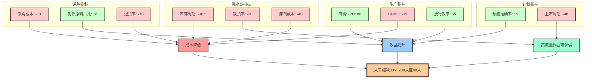

# **云南白药灯塔工厂智能制造内容梳理**

---

## 一、实地参观情况概述

#### 云南白药灯塔工厂是全球首座中医药健康品领域的灯塔工厂，也是云南省首座入选世界经济论坛“全球灯塔网络”的智能制造标杆。工厂以AI为核心驱动力，部署了40余项4IR（第四次工业革命）技术。覆盖种植、采购、生产、研发、销售全链条，实现了从传统制造向智能制造的全面转型，下面进行核心能力分析简述。


## 二、质的飞跃和经营指标

工厂在多个关键经营指标上实现显著提升：

- **库存周期**：下降35%～38%

- **采购成本**：下降13%

- **优质原料占比**：提升26个百分点

- **退货率**：下降78%

- **制膏UPH（单位人时产能）**：提升80%

- **百万缺陷数DPMO**：下降39%

- **放行效率**：提升55%

- **需求预测准确率**：提升19个百分点

- **新品上市周期**：缩短48%

- **缺货率**：下降30%

- **滞销成本**：下降48%

  ### **核心指标升降图**
  
  ```mermaid
  %%{init: {'theme':'default', 'width': '500px', 'height': '400px'}}%%
  
  graph TD;
      A[开始] --> B[结束];
  
      subgraph 供应链指标
          A[库存周期: -36.5]
          B[缺货率: -30]
          C[滞销成本: -48]
      end
  
      subgraph 采购指标
          D[采购成本: -13]
          E[优质原料占比: 26]
          F[退货率: -78]
      end
  
      subgraph 生产指标
          G[制膏UPH: 80]
          H[DPMO: -39]
          I[放行效率: 55]
      end
  
      subgraph 计划指标
          J[预测准确率: 19]
          K[上市周期: -48]
      end
  
      style A fill:#f00
      style B fill:#f00
      style C fill:#f00
      style D fill:#f00
      style E fill:#0f0
      style F fill:#f00
      style G fill:#0f0
      style H fill:#f00
      style I fill:#0f0
      style J fill:#0f0
      style K fill:#f00
  ```
  
  
  
  ### **指标关联关系图**



---


## 三、基础自动化实现

- **APS（高级计划与排程系统）**：覆盖牙膏生产线200+品规，实现智能自动排产（替代老师傅传统excel排产）。
- **MES系统**：支撑生产执行，虽未完全统一，但已在关键环节落地。
- **L2C（线索到现金）系统**：实现合同线上化、窜货分析、返利计算等，推动销售流程数字化。
- **集成供应链系统**（erp）：实现物流与承运商实时对单，优化配送网络，年节约运输费用超5000万元。

---


## 四、全方位的整体设计

工厂构建了“1+1+N”的中药材产业数字化平台（数智云药），整体设计原则涵盖了100个用例规划、已落地的40个，其中核心技术涵盖：

- 业务驱动型交易
- 信息驱动型对接
- 技术驱动型招采
- 资源驱动型服务
- N个产地复制推广

同时推动“三个一”AI落地策略（每一个场景都至少有一个AI场景应用）：

- 一个**人工智能底座平台**
- 一套**人工智能应用体系**
- 一支**人工智能人才队伍**

### 推进关键

**人：董事长总经理挂帅牵动**、部门有个懂信息化的bp\coe\ssc

**财：总投资在1亿元左右**，几乎没有硬件的投入（能沿用的沿用）

**资：业务变革先行、鼓励创新机制、业务团队融合**

工厂细节补充：共六条线、两快两中两慢

工厂流程梳理 --上料---一键制膏----一件上料---码垛

如何在同仁堂产能过剩的情况下如何挖掘剩余价值。

---


## 五、AI赋能工厂生产

### 种植端：
- **雷公大模型**：实现种植面积普查、产能预测（准确率90%）、中药材智能识别。

### 研发端：
- **AI辅助药物设计**：依托高通量计算中心、靶点发现平台、A1辅助抗体设计平台。
- **内部数据库**：涵盖单细胞转录组、蛋白质组等数据，靶点评估效率大幅提升。

### 生产端：
- **设备自动管理AI助理团**：提供数据、知识、工单助理，预期人效提升60%。
- **一键制膏与快速换型**：提升制膏效率80%，制膏时间速率每分钟150支（非全部负载）
- **一件上料与封装**：将膏体抽送到上料车间实现自动灌装上料。

### 销售与服务端：
- **智能客服AI助理团**：提升客户满意度5%，降低人工客服时间30%。
- **智能辅助诊断与开方**：基于大模型提供个性化治疗方案，构建“药品-诊疗-健康管理”闭环。

---

## 六、质量检测与识别（保障和如何落地，挂件成功要素）

- **中药材质量鉴别大模型**：基于1.5万条高质量标注数据（三七、茯苓等），实现分拣效率提升30-50倍，准确率提升300%，单品茯苓退换货成本年节约5000万。
- **生产过程AI风险识别**：设备巡检工作量下降60%，百万缺陷数下降39%。
- **包材智检系统**：应用于外包装法规合规性检测、设计一致性校验、生产线实时印刷检测，提升包材检测效率。
- 数字化是营销前台的客户，感知用户需求（增加复购、口碑营销

---

营销侧重去改。


